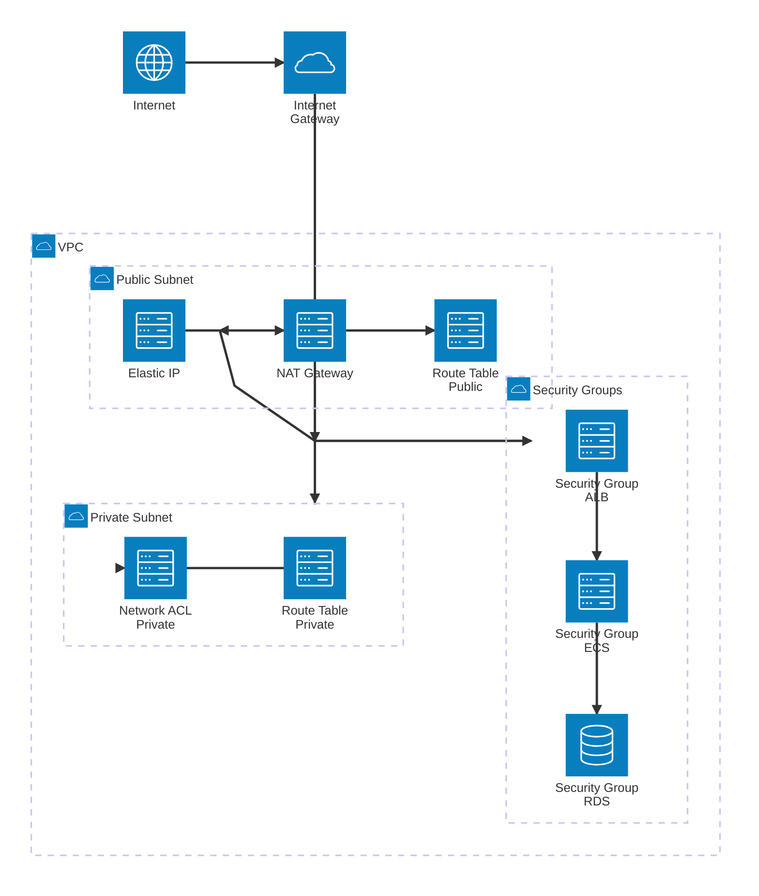

```mermaid
architecture-beta
    service internet(internet)[Internet]
    service igw(cloud)[Internet Gateway]
    
    group vpc(cloud)[VPC]
    
    group public_subnet(cloud)[Public Subnet] in vpc
    service eip(server)[Elastic IP] in public_subnet
    service nat_gateway(server)[NAT Gateway] in public_subnet
    service rt_public(server)[Route Table Public] in public_subnet
    
    group private_subnet(cloud)[Private Subnet] in vpc
    service rt_private(server)[Route Table Private] in private_subnet
    service nacl_private(server)[Network ACL Private] in private_subnet
    
    group security_groups(cloud)[Security Groups] in vpc
    service sg_alb(server)[Security Group ALB] in security_groups
    service sg_ecs(server)[Security Group ECS] in security_groups
    service sg_rds(database)[Security Group RDS] in security_groups
    
    junction routing_point in vpc
    
    internet:R --> L:igw
    igw:B --> T:routing_point
    routing_point:L --> R:eip{group}
    eip:R --> L:nat_gateway
    nat_gateway:R --> L:rt_public
    routing_point:B --> T:rt_private{group}
    rt_private:R --> L:nacl_private
    routing_point:R --> L:sg_alb{group}
    sg_alb:B --> T:sg_ecs
    sg_ecs:B --> T:sg_rds
```