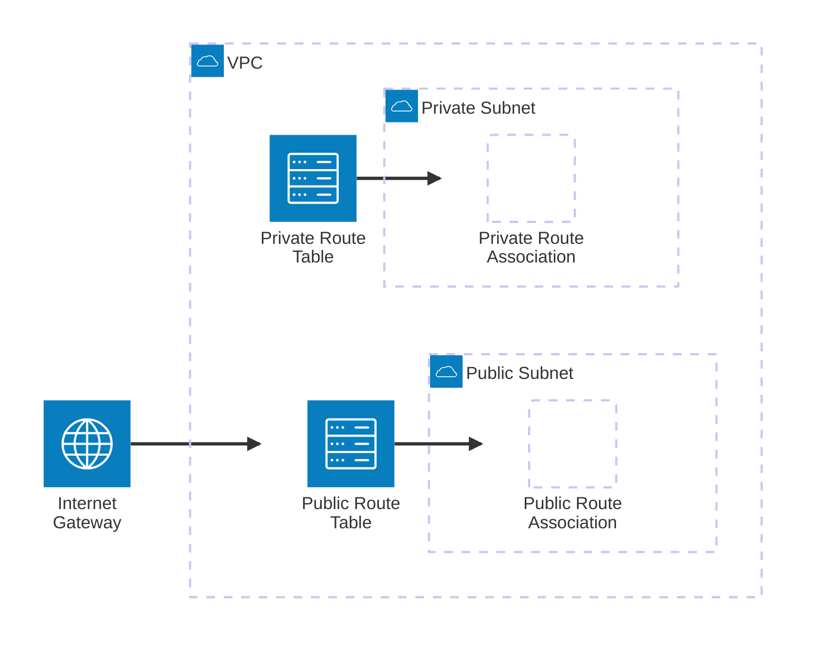

```mermaid
architecture-beta
    service internet_gateway(internet)[Internet Gateway]
    
    group vpc(cloud)[VPC]
    
    group public_subnet(cloud)[Public Subnet] in vpc
    group private_subnet(cloud)[Private Subnet] in vpc
    
    service public_route_table(server)[Public Route Table] in vpc
    service private_route_table(server)[Private Route Table] in vpc
    
    service public_route_association[Public Route Association] in public_subnet
    service private_route_association[Private Route Association] in private_subnet
    
    internet_gateway:R --> L:public_route_table{group}
    public_route_table:R --> L:public_route_association{group}
    private_route_table:R --> L:private_route_association{group}
```